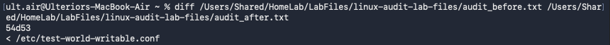
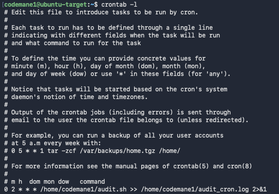
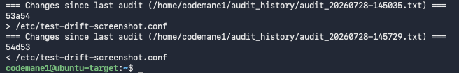

# Linux Log Auditing & Permission Hardening

## What this demonstrates

Systems auditing from first principles — a self-written script that inspects a machine's actual security posture (failed authentication attempts, file permission misconfigurations) rather than relying on a pre-built tool, followed by a genuine remediation with before/after proof it worked.

## Environment

- **Target:** Ubuntu Server VM (same host used across this lab's other projects)
- **Audited sources:** `/var/log/auth.log` (authentication history), `/etc` (system configuration files)

## Process

### 1. Establish a real, detectable misconfiguration

```bash
sudo touch /etc/test-world-writable.conf
sudo chmod 666 /etc/test-world-writable.conf
```

`666` grants read and write access to the file's owner, group, **and every other user on the system** — a genuine privilege-escalation risk in a real environment, since any low-privileged user could modify a file a more privileged process might later read or execute.

### 2. Write the audit script

```bash
#!/bin/bash
# audit.sh — basic Linux security audit: failed logins + world-writable files

echo "=== Failed SSH login attempts (last 50) ==="
grep "Failed password" /var/log/auth.log | tail -50

echo ""
echo "=== World-writable files under /etc ==="
find /etc -type f -perm -o+w 2>/dev/null
```

The permission check — `find /etc -type f -perm -o+w` — reads as: regular files, under `/etc`, where the "others" permission bit specifically includes write access. The `-o+w` syntax checks that one bit directly rather than requiring an exact permission-number match, so it correctly catches `666`, `662`, `646`, or any other mode with that bit set — not just the one specific value used to create the test file.

### 3. Run the audit and confirm it catches the test file

```bash
chmod +x audit.sh
./audit.sh
```

Result: `/etc/test-world-writable.conf` correctly appears under the world-writable section.

### 4. Remediate

```bash
sudo chmod 644 /etc/test-world-writable.conf
```

`644` = owner read+write, group and others read-only — a standard, safe default for a configuration file.

### 5. Re-run the audit and confirm the fix directly

```bash
./audit.sh > audit_after.txt
diff audit_before.txt audit_after.txt
```

Result:
```
54d53
< /etc/test-world-writable.conf
```

A single-line diff, isolating the fix precisely: the file present in the pre-remediation audit, genuinely absent afterward — direct, verifiable proof the remediation worked, not just an assertion that it should have.

## Key finding

The `diff` between the two audit runs is the actual evidence here — not a description of what should have happened, but a machine-verifiable comparison showing exactly one thing changed between "before" and "after," and that it was the correct thing. This is the difference between a detection and a demonstrated fix.

## Files in this repo

- `audit.sh` — the original point-in-time audit script
- `audit_before.txt` — full audit output prior to remediation
- `audit_after.txt` — full audit output after remediation
- `audit_v2_drift_detection.sh` — the upgraded script with automatic drift detection (see addendum below)
- `audit_cron.log` — output from a simulated unattended cron run
- `audit_history/` — timestamped audit snapshots the upgraded script generates on each run
- `screenshots/` — see below

## Screenshots





## What I'd do differently in production

- Extend the permission check beyond `/etc` to other sensitive directories (`/var/www`, application config paths) relevant to the specific system being audited.
- Add a check for world-writable *directories*, not just files — a writable directory can be an even more direct privilege-escalation path, since it allows creating or replacing files entirely.

---

## Addendum: Continuous Drift Detection via Cron

### What this adds

The original script proved a point-in-time audit and a one-time remediation. This upgrade turns it into **ongoing** monitoring — every run is saved as a timestamped snapshot and automatically diffed against the previous run, so new findings are flagged as *changes since last check*, not just items in a flat list. Scheduled via `cron` to run unattended.

### The upgraded script

```bash
#!/bin/bash
# audit_v2_drift_detection.sh — with drift detection

TIMESTAMP=$(date +%Y%m%d-%H%M%S)
OUTDIR=~/audit_history
mkdir -p "$OUTDIR"

{
  echo "=== Failed SSH login attempts (last 50) ==="
  grep "Failed password" /var/log/auth.log | tail -50
  echo ""
  echo "=== World-writable files under /etc ==="
  find /etc -type f -perm -o+w 2>/dev/null
} > "$OUTDIR/audit_$TIMESTAMP.txt"

LATEST_PREV=$(ls -t "$OUTDIR"/audit_*.txt | sed -n '2p')

if [ -n "$LATEST_PREV" ]; then
  echo "=== Changes since last audit ($LATEST_PREV) ==="
  diff "$LATEST_PREV" "$OUTDIR/audit_$TIMESTAMP.txt"
else
  echo "No previous audit found — this is the baseline."
fi
```

### Scheduled via cron

```
0 2 * * * /home/codemane1/audit.sh >> /home/codemane1/audit_cron.log 2>&1
```
Runs daily at 2:00 AM, appending output to a persistent log rather than requiring anyone to remember to run it manually.

### Verified in both directions

A test file was created (triggering a detected *addition*), then removed (triggering a detected *removal*), each correctly flagged on the very next run:
```
=== Changes since last audit (.../audit_20260728-145035.txt) ===
53a54
> /etc/test-drift-screenshot.conf
=== Changes since last audit (.../audit_20260728-145729.txt) ===
54d53
< /etc/test-drift-screenshot.conf
```
The unattended path was also verified directly — running the script with the exact redirect syntax cron uses (`>> audit_cron.log 2>&1`) produced identical, correctly-formatted output in the log file, confirming the scheduled job will behave the same way at 2 AM with no one watching as it does when run manually.

### Key finding

The distinction between "a script that audits" and "a system that monitors" comes down to exactly this: does a new finding get compared against a known-good prior state, or does it just get reported fresh every time with no memory of what came before? Point-in-time auditing tells you what's wrong right now; drift detection tells you *when* it became wrong — a meaningfully more useful signal for actually catching an intrusion or misconfiguration close to when it happened, rather than discovering it in some later, unrelated audit.